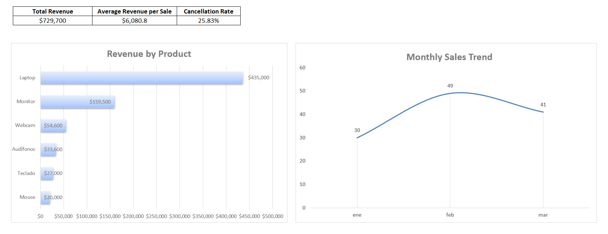

# Excel Sales Analysis Practice

## Executive Summary

This project analyzes quarterly raw data from a company's sales department using Excel tools, from data cleaning to business insights. The analysis included formulas, XLOOKUP, PivotTables, and a simplified dashboard with key KPIs. Some of the main findings were that 45% of all sales were either cancelled or pending, and that webcams had the highest number of units sold. The goal was to practice Excel formulas, PivotTables, and basic data analysis using a sales dataset.

## Skills Practiced

- Data cleaning
- Excel formulas
- PivotTables
- KPI calculation
- Dynamic filtering
- Dashboard creation

## Workbook Structure

- **Sales:** Original sheet containing the raw data of the dataset.

- **Questions:** Business questions we came up with and answered by analyzing the dataset.

- **Analysis:** Data cleaning, including removing extra whitespace and converting some values from text to numbers. This sheet also includes filtering with specific criteria and the calculation of the first KPIs.

- **Sales_Pivot:** Examples of the PivotTables used during the analysis to summarize and compare the data.

- **Dashboard:** Shows the three main sales KPIs: Total Revenue, Average Revenue per Sale, and Cancellation Rate. It also includes two charts showing which products generated the most revenue and the sales trend during the first quarter of the year.

## Key Findings

- 45% of all sales were either cancelled or pending, so it would be useful to check why such a large number of transactions were not completed.

- Webcams had the highest number of units sold, but they generated much less revenue than laptops and monitors. It would be worth checking whether there is an opportunity to improve their revenue.

- Luis generated the lowest total revenue among all salespeople. His sales should be reviewed to understand whether this was due to fewer transactions, lower-value sales, or another reason.

## Dashboard

The dashboard summarizes the main results of the analysis using three KPIs and two charts. It shows Total Revenue, Average Revenue per Sale, Cancellation Rate, Revenue by Product, and the Monthly Sales Trend.

## Files

This repository contains an Excel workbook divided into several sheets, including the raw data, business questions, analysis using formulas and PivotTables, and the final dashboard.

The practice dataset was generated with the help of ChatGPT and intentionally included data quality issues for cleaning and analysis practice.